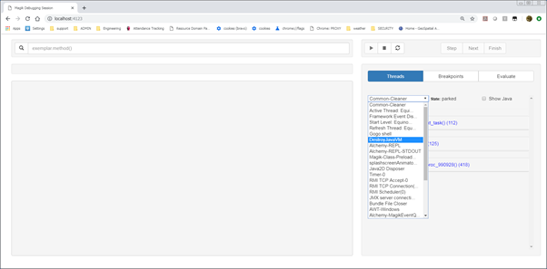
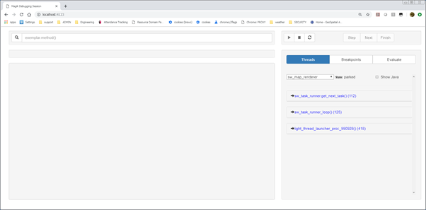
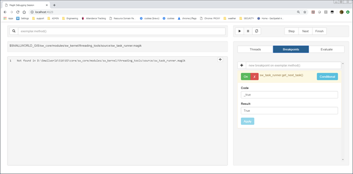
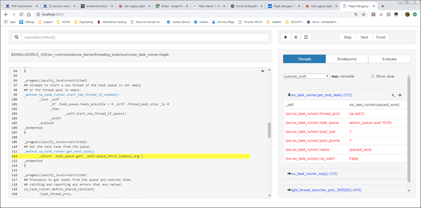

# Smallworld 5 Magik debugger

Copyright Informationx

&copy; 2018 General Electric Company or its Affiliates

Licensed under the Apache License, Version 2.0 (the "License"); you may not use this file except in compliance with the License. You may obtain a copy of the License at

[http://www.apache.org/licenses/LICENSE-2.0](http://www.apache.org/licenses/LICENSE-2.0)

Unless required by applicable law or agreed to in writing, software distributed under the License is distributed on an "AS IS" BASIS, WITHOUT WARRANTIES OR CONDITIONS OF ANY KIND, either express or implied. See the License for the specific language governing permissions and limitations under the License.

The information contained in this document is subject to change without notice.

The software described in this document is supplied under licence and may be used or copied only in accordance with the terms of such licence.

| Date    | 28/02/2019    |
| ------- | ------------- |
| Version | 0.8           |
| Author  | GE Smallworld |

## Contents

[Installing and starting the debugger](#installing-and-starting-the-debugger)

[Components of the debugger](#components-of-the-debugger)

[Starting a session with the debug agent running](#starting-a-smallworld-session-with-the-debug-agent-running)

[Windows](#windows)

[Linux](#linux)

[Starting the debug client in node.js](#starting-the-debug-client-in-node.js)

[Starting the web GUI](#starting-the-web-gui)

[Using the Magik debugger](#using-the-magik-debugger)

[Functions available in the debugger web GUI](#functions-available-in-the-debugger-web-gui)

[Screenshots](#screenshots)

[Debugger Web GUI](#_Toc2341902)

[List of threads](#list-of-threads)

[Thread stack trace](#thread-stack-trace)

[Limitations](#limitations)

## Installing and starting the debugger

### Components of the debugger

There are 3 components.

Item | Description | Prerequisites
---------|----------|---------
 Debug agent | This is shipped as a DLL (Windows: _mda.dll_) or shared library (Linux &amp; Solaris: _libmda.so_) | Smallworld 515 or later
 Debug client running in node.js | Available from [https://github.com/OpenSmallworld/magik-debugger](https://github.com/OpenSmallworld/magik-debugger). Clone or download the zip file and put in folder such as _c:\magik-debugger_| Minimum of node.js v8 required.
 Web-based GUI | Browser based | Chrome or FireFox browsers. Internet Explorer not recommended

Note that the components can be co-located on the same host, or run from different hosts.

Note that source code is not a prerequisite for all functions of the debugger. It is possible to set breakpoints and inspect running threads without this.

Information in this document is based on the following component versions

| Component          | Version            | Comments   |
| ------------------ | ------------------ | ---------- |
| Smallword          | 519                |            |
| Magik debug agent  | 14                 |            |
| Magik debug client | "version": "0.1.1" | 2018-05-25 |
| Node.js            | 10.15.1            | LTS stream |

## Starting a Smallworld session with the debug agent running

The additional Java argument **-agentpath** is passed to the Magik session with the full path to the agent library as a parameter.

Examples

## Windows

> runalias.exe **-j -agentpath:%SMALLWORLD_GIS%\core\bin\x86\mda.dll** -a %SMALLWORLD_GIS%\..\cambridge_db\config\gis_aliases cambridge_db_open_no_auth

## Linux

> /opt/smallworld/core/bin/share/runalias **-j -agentpath:/opt/smallworld/core/bin/Linux.x86/libmda.so** -a /opt/smallworld/cambridge_db/config/gis_aliases cambridge_db_open_no_auth

Alternatively, this can be added to an alias using environment variable **SW_LAUNCH_JAVA_ARGS** :

> eo_suite_open_dbg:
> title = Start Smallworld Electric Office Product Suite  
> session = sw_electric_office:eo_suite_open  
> SW_ACE_DB_DIR = %SMALLWORLD_GIS%/../electric_office/example_db/ds/ds_admin  
> SW_CONSTRUCTION_PACK_DIR= C:/Temp  
> SW_LAYOUT_DOCUMENT_DIR = C:/Temp  
> splash_screen = %SMALLWORLD_GIS%/../electric_office/resources/base/bitmaps/smallworld_electric_splash.png  
> product = sw_electric_office  
> args = -cli  
> SW_LAUNCH_JAVA_MEMORY = -Xmx1500m  
> **SW_LAUNCH_JAVA_ARGS = %SW_LAUNCH_JAVA_ARGS% -agentpath:%SMALLWORLD_GIS%\bin\x86\mda.dll**

Starting the session for debugging then becomes:

> %SMALLWORLD_GIS%\core\bin\x86\runalias.exe -a %SMALLWORLD_GIS%\electric_office\config\gis_aliases **eo_suite_open_dbg**

A magik session can be started with the debug agent enabled. The debugger is then connected when required. In-house testing shows that there appears to be little overhead in the Magik process when this is run.

**IMPORTANT** A debugger session should NOT be left unattended in a production environment, as this poses a serious security risk.

Note that **-agentpath** also accepts an additional argument to specify the port for the client. This is useful if multiple instances of the debugger need to be run:

Example:

> %SMALLWORLD_GIS%\core\bin\x86\runalias.exe **-j -agentpath:%SMALLWORLD_GIS%\core\bin\x86\mda.dll=socket:20001** -a %SMALLWORLD_GIS%\electric_office\config\gis_aliases eo_suite_open

## Starting the debug client in node.js

In order for the source code to be located, environment variables have to be defined for the session running the node.js Magik debugger client, to point to the locations of source.

Product | Variable name
---------|----------
 Core product | SMALLWORLD_GIS
 Other products | These are in the format &lt;UPPERCASE PRODUCT NAME&gt;_DIR. For example, for the PNI product, the variable would be named:**PNI_DIR**

Assuming that the Debug client source is in c:\magik\debugger, as in the install example above

> cd c:\magik-debugger
> c:\magik\debugger >npm start localhost:32000
> \> magik.debugger@0.1.1 start c:\magik-debugger
> \> node server.js "localhost:32000"
> **Listening on port 4123**
> **Connected to agent version 14**

The Debug Agent communicates with the Debug Client using a TCP/IP connection which by default has a port number of **32000**. This can be specified when starting up the debug client, as described in the previous section.

The port for the Web GUI defaults to **4123** but is configurable using environment variable **PORT.** This is useful if multiple debugger sessions need to be run on the same host.

## Starting the web GUI

Assuming the port shown was as in the example above (4123) :

Start your web browser, and enter ```localhost:4123```

You should see a display similar to this:


## Using the Magik debugger

### Functions available in the debugger web GUI

1.Threads

- Suspend and resume threads
- Look at the stack frame for a thread.

2.Breakpoints
  
- Set breakpoints on method entry using the breakpoint tab  
- Set breakpoints in methods at a specific source file location. Once the GUI knows about a source file one can single click on a source line to set a breakpoint. Note that this currently only works for methods.

3.Variables
  
- Examine local variables and object slots in a suspended thread.
- Evaluate arbitrary Magik expressions in a given stack frame on a
        thread (click on the ">_" button on the stack frame)

4.Step execution.

- **GUI Line step**: steps to the next line of Magik source whether it is the current method or not.
- **GUI Over**: steps to the next Magik line in the current method or its caller.
- **GUI Out**:  steps until control is returned to the next Magik line executed in a method calling this one.
      - To stop execution stepping, suspend the thread.

### Screenshots

Scenario:

- List threads
- Set breakpoint in *sw_task_runner.get_next_task()*
- On break, jump to source

#### Thread tab (List of threads)



#### Thread tab (Selected thread stack trace)



#### Breakpoint tab



#### Thread tab (Jumping to source)



This also shows the variable list for the stack execution stage when expanded.

### Limitations

Item | Limitation | Notes
---------|----------|---------
 Line Numbers | Sending magik code from emacs to the Magik session will lead to a mismatch in line numbers between the original code and what is compiled. Hence the debugger will not have accurate line number information. | The emacs lisp magik customization sends three extra source lines at the start of the file.
 Breakpoints | Cannot set breakpoints when entering a Magik **_proc** |
  &nbsp;  | Cannot set breakpoints on Java methods | |
  Stepping |Stepping of execution can be very slow. | Line steps are generally not too slow.
 &nbsp; | If the **Over** functionality has to step over a method invocation which does a lot of processing, then the time to run the step can be extremely large. |
 &nbsp; | Similarly, the time take to execute **GUI Out** functionality can be large. | &nbsp;
 Variables | The structure of the Magik code matches what is generated by the compiler not the source code. | This is a side-effect of cross-compilation.
  &nbsp; | For example, the body of a loop appears as a separate method on the stack frame. As this has its own variable scope, the **_local** variables viewed in the loop body only be those used in the loop body. **_local** variables defined in the enclosing method and loop bodies but which are not used in the loop body will not be visible. In the example, when debugging the loop, variable **a** will not be visible, but variables **i**, **var_b** will be visible| See [Example 1](#example-1)
 &nbsp; |Similar, but slightly different: | For example, the debugger will not see the **_local** _a_ in [Example 2](#example-2)
 &nbsp; | **_local** variables defined in a method but only set inside loops nested in the method might not be picked up by the debugger. |
 &nbsp; | The debugger cannot access **_dynamic** variables. |
 Evaluate function | Evaluating an expression can set **_global** variables. It cannot set **_local** variables. |
  &nbsp; | When evaluating an expression **_self** is transformed into a different form of variable lookup.Accessing private methods and slots has to be done with **sys!perform()** and **sys!slot()** respectively. |
 &nbsp; |Evaluation of the expression **quit()** will not have the expected effect. | quit() is effectively disabled in the evaluation mechanism
Various |Viewing the source code for a _**loopbody** does not work. The GUI cannot translate the stack frame for a _**loopbody** into a meaningful method name to look up in the source|  This is a consequence of the cross-compilation from Magik to Java.Changing this would be a major piece of work

#### Example 1

```magik
 _method thing.test(a, b)
     a << 0
 _for j _over a.elements()
 _loop  
    var_b << 99  
      _for i _over b.elements()
      _loop
           var_b +<< i.operate(j)
      _endloop
 _endloop
   >> a
_endmethod
$

```

#### Example 2

```magik
_method thing.test(a, b)
     a << 0
 _for j _over a.elements()
 _loop
      _for i _over b.elements()
      _loop
           a+<< i.operate(j)
      _endloop
 _endloop
   >> a
_endmethod
$
```
